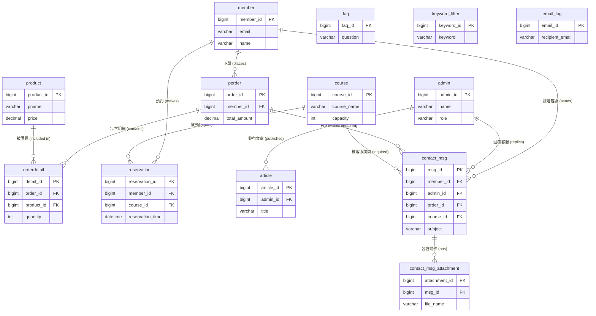

```mermaid

erDiagram
    %% ==========================================
    %% 核心實體 (Parent Tables)
    %% ==========================================
    member {
        bigint member_id PK
        varchar email
        varchar name
    }
    
    admin {
        bigint admin_id PK
        varchar name
        varchar role
    }
    
    product {
        bigint product_id PK
        varchar pname
        decimal price
    }
    
    course {
        bigint course_id PK
        varchar course_name
        int capacity
    }
    
    porder {
        bigint order_id PK
        bigint member_id FK
        decimal total_amount
    }

    %% ==========================================
    %% 子實體與明細 (Child Tables)
    %% ==========================================
    orderdetail {
        bigint detail_id PK
        bigint order_id FK
        bigint product_id FK
        int quantity
    }
    
    reservation {
        bigint reservation_id PK
        bigint member_id FK
        bigint course_id FK
        datetime reservation_time
    }
    
    article {
        bigint article_id PK
        bigint admin_id FK
        varchar title
    }
    
    contact_msg {
        bigint msg_id PK
        bigint member_id FK
        bigint admin_id FK
        bigint order_id FK
        bigint course_id FK
        varchar subject
    }

    contact_msg_attachment {
        bigint attachment_id PK
        bigint msg_id FK
        varchar file_name
    }

    %% ==========================================
    %% 獨立實體 (Standalone)
    %% ==========================================
    faq {
        bigint faq_id PK
        varchar question
    }
    
    keyword_filter {
        bigint keyword_id PK
        varchar keyword
    }
    
    email_log {
        bigint email_id PK
        varchar recipient_email
    }

    %% ==========================================
    %% 關聯線定義 (Relationships)
    %% ==========================================
    
    %% 會員 (Member) 的關聯
    member ||--o{ porder : "下單 (places)"
    member ||--o{ reservation : "預約 (makes)"
    member ||--o{ contact_msg : "發送客服 (sends)"

    %% 管理員 (Admin) 的關聯
    admin ||--o{ article : "發布文章 (publishes)"
    admin ||--o{ contact_msg : "回覆客服 (replies)"

    %% 訂單 (Porder) 的關聯
    porder ||--|{ orderdetail : "包含明細 (contains)"
    porder ||--o{ contact_msg : "被客服詢問 (inquired)"

    %% 商品 (Product) 的關聯
    product ||--o{ orderdetail : "被購買 (included in)"

    %% 課程 (Course) 的關聯
    course ||--o{ reservation : "被預約 (has)"
    course ||--o{ contact_msg : "被客服詢問 (inquired)"

    %% 客服訊息 (Contact Msg) 的關聯
    contact_msg ||--o{ contact_msg_attachment : "包含附件 (has)"
```

